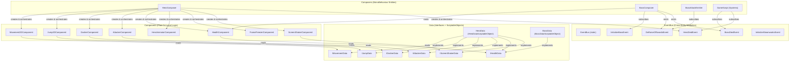

> **Human-Only Visual Reference**: AI agents skip this file (equivalent specification lives in [core-patterns.md](../architecture/core-patterns.md)).

# Core Architecture: Composition + EventBus

```mermaid
flowchart TD
    subgraph ComposerLayer["Composers (MonoBehaviour Entities)"]
        direction TB
        HC["HeroComposer"]
        BC["BossComposer"]
        BAE["BossAttackEmitter"]
        GS["GameScript (Systems)"]
    end

    subgraph ComponentLayer["Components (Plain C# Local Logic)"]
        direction TB
        M2D["Movement2DComponent"]
        J2D["Jump2DComponent"]
        DC["DasherComponent"]
        AC["AttackerComponent"]
        HTC["HealthComponent"]
        HAC["HeroAnimatorComponent"]
        FFC["FrameFreezerComponent"]
        SSC["ScreenShakerComponent"]
    end

    subgraph DataLayer["Data (Interfaces + ScriptableObjects)"]
        direction TB
        IMove["IMovementData"]
        IJump["IJumpData"]
        IDash["IDasherData"]
        IAtk["IAttackerData"]
        IHlt["IHealthData"]
        IShk["IScreenShakerData"]
        HD["HeroData (HeroDataScriptableObject)"]
        BD["BossData (BossDataScriptableObject)"]
    end

    subgraph EventLayer["EventBus (Cross-Entity Mediation)"]
        direction TB
        EB["EventBus (static)"]
        IBE["InitializeBossEvent"]
        DRS["DoRaiseOfSwordsEvent"]
        BDE["BossDiedEvent"]
        HDE["HeroDiedEvent"]
        ISE["InitializeSteamworksEvent"]
    end

    HC -->|"creates & orchestrates"| M2D
    HC -->|"creates & orchestrates"| J2D
    HC -->|"creates & orchestrates"| DC
    HC -->|"creates & orchestrates"| AC
    HC -->|"creates & orchestrates"| HTC
    HC -->|"creates & orchestrates"| HAC
    HC -->|"creates & orchestrates"| FFC
    HC -->|"creates & orchestrates"| SSC
    BC -->|"creates & orchestrates"| HTC

    M2D -->|"reads"| IMove
    J2D -->|"reads"| IJump
    DC -->|"reads"| IDash
    AC -->|"reads"| IAtk
    HTC -->|"reads"| IHlt
    SSC -->|"reads"| IShk

    HD -->|"implements"| IMove
    HD -->|"implements"| IJump
    HD -->|"implements"| IDash
    HD -->|"implements"| IAtk
    HD -->|"implements"| IHlt
    HD -->|"implements"| IShk
    BD -->|"implements"| IHlt

    BC -->|"subscribes"| IBE
    BC -->|"emits"| DRS
    BAE -->|"subscribes"| DRS
    BC -->|"emits"| BDE
    HC -->|"emits"| HDE
    GS -->|"subscribes"| BDE
    GS -->|"subscribes"| HDE
```
