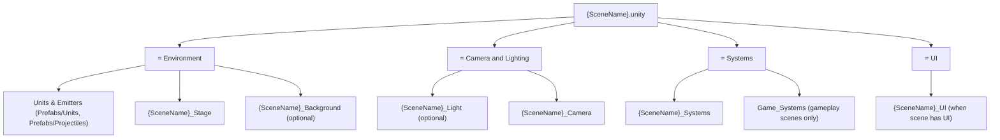

> **Human-Only Visual Reference**: AI agents skip this file (equivalent specification lives in [scene-hierarchy.md](../architecture/scene-hierarchy.md)).

# Scene Hierarchy Root Skeleton

```mermaid
flowchart TD
    Scene["{SceneName}.unity"] --> E["= Environment"]
    Scene --> C["= Camera and Lighting"]
    Scene --> S["= Systems"]
    Scene --> U["= UI"]

    E --> E1["Units & Emitters (Prefabs/Units, Prefabs/Projectiles)"]
    E --> E2["{SceneName}_Stage"]
    E --> E3["{SceneName}_Background (optional)"]

    C --> C1["{SceneName}_Light (optional)"]
    C --> C2["{SceneName}_Camera"]

    S --> S1["{SceneName}_Systems"]
    S --> S2["Game_Systems (gameplay scenes only)"]

    U --> U1["{SceneName}_UI (when scene has UI)"]
```
